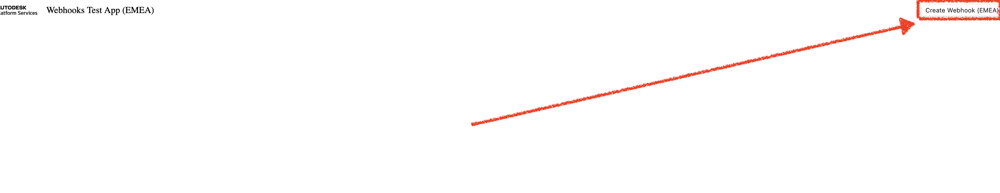
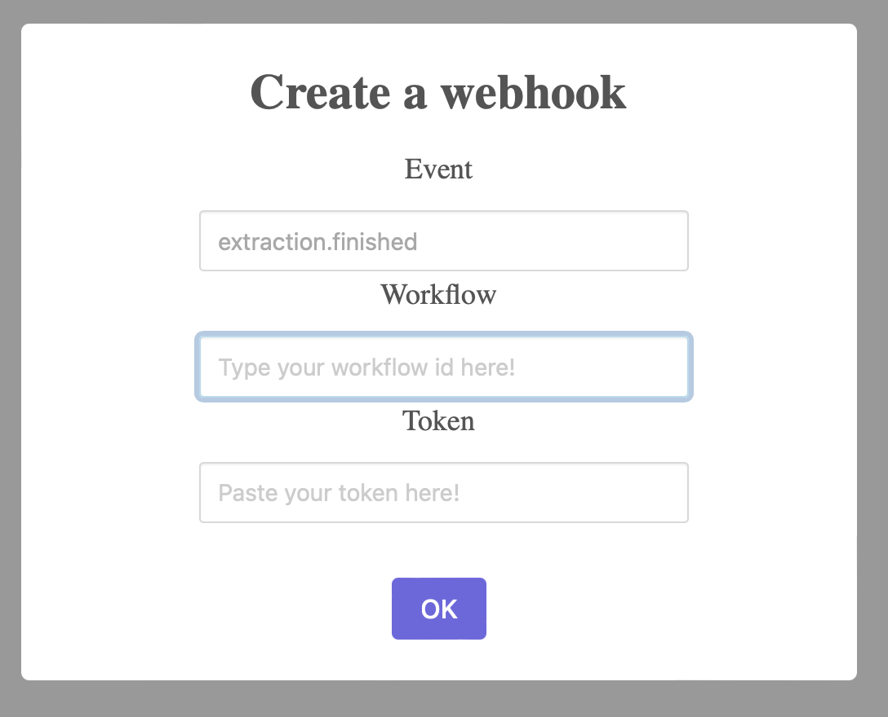
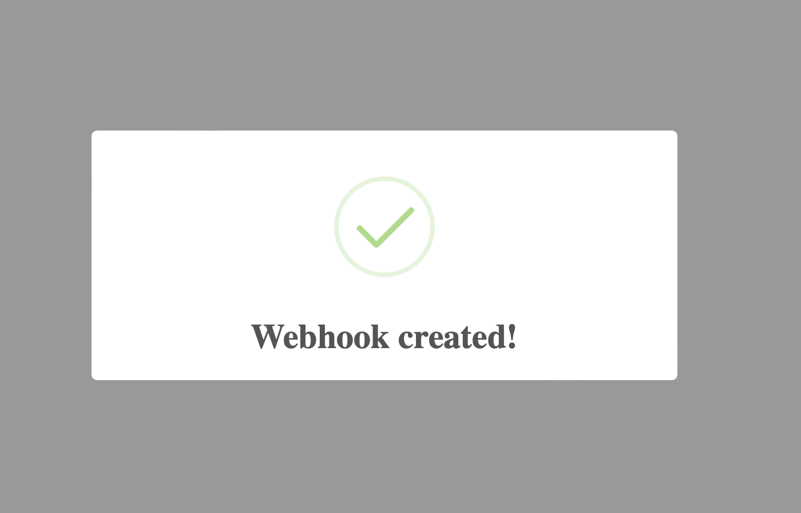
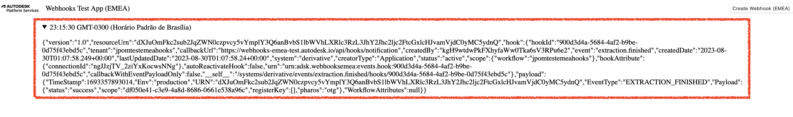

# aps-webhooks-test

Sample for testing web hooks

## Introduction

The purpose of this sample is to help you test webhooks 'extraction.finished' event for emea objects.

## How to run it

This sample is currently available at https://webhooks-emea-test.autodesk.io, and it works in a way that you can paste your token and a workflow id of your choice to create a webhook (listening to 'extraction.finished' event).

First step, you'll need to obtain a 2-legged token.
You can do that through tools such as Insomnia, Postamn or a curl command, [just like in our tutorials](https://aps.autodesk.com/en/docs/oauth/v2/tutorials/get-2-legged-token/)

To create a Webhook, the token needs the 'data:read' and 'data:create' scopes.

With that, you're able to use this sample app.

You just need to click on 'create webhook' button at the top right corner

After that, you'll see a window with options to input the two-legged token and workflow-id (just like the one below)

If you type a valid token and a correct workflow id, you'll see a success message.

**From now it is important that you keep this window open, so the connection between server and your client remains valid with the id passed to the hook**

With that, you can now use this workflow id to [POST job](https://aps.autodesk.com/en/docs/model-derivative/v2/reference/http/jobs/job-POST/) for the translation you wanna test.

To start the translation, you'll need to use once more Insomnia or Postman with tha same workflow id.

After the translation finishes, you should see your hook payload just like in the image below

